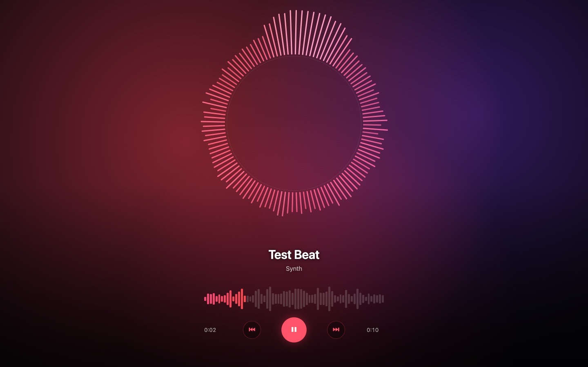
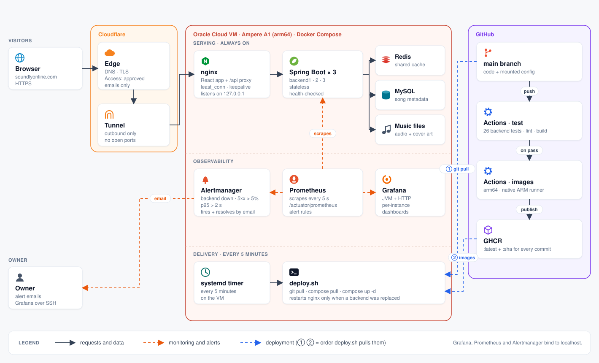
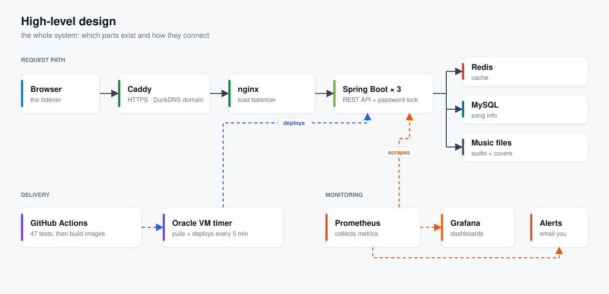
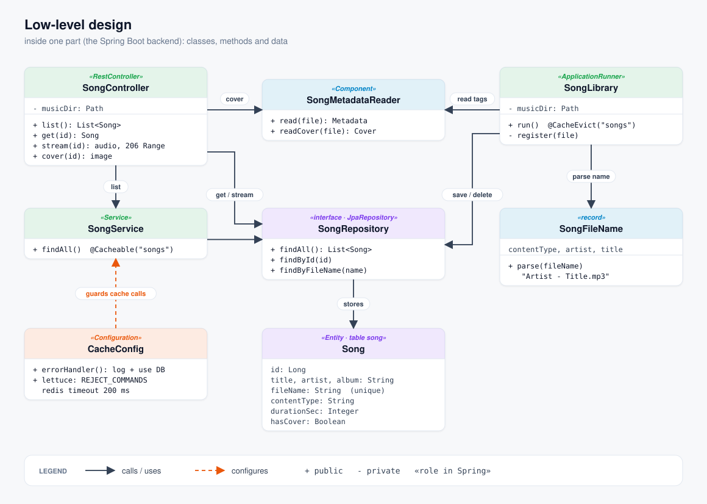

# Soundly

A self-hosted music streaming service: a React player in front of three load-balanced Spring Boot backends, with caching, monitoring, alerting, failure testing and automated deployment to a cloud VM.

The live instance at [soundlyonline.com](https://soundlyonline.com) is access-restricted, because it serves a personal music library. Access for a demo is available on request.



## Architecture



**How a request flows:**

1. Cloudflare terminates TLS and checks identity with Cloudflare Access. Unauthenticated requests never reach the server.
2. A Cloudflare Tunnel carries traffic to the VM over an outbound connection, so the VM has no inbound ports open.
3. nginx serves the built React app and proxies `/api/` to three identical, stateless Spring Boot backends.
4. Each backend reads song metadata from MySQL through a shared Redis cache, and streams audio from disk with HTTP Range support so the player can seek.

**Delivery:** Images are only published from `main`, and only after both test jobs pass. The server pulls both new images and config changes from git, since nginx, Prometheus and alerting configuration are mounted from the repo rather than built into images. Each image is tagged with its commit SHA, so any deploy can be rolled back to an exact build.

## Design

**High-level design**: the parts of the system and how they connect.



**Low-level design**: inside the Spring Boot backend: classes, methods and data model.



## Tech stack

| Layer | Technology |
|---|---|
| Frontend | React 19, Vite 8 |
| Backend | Java 21, Spring Boot 4.1, Spring Data JPA, Spring Cache |
| Data | MySQL 8, Redis 7 |
| Edge | nginx, Cloudflare Tunnel, Cloudflare Access |
| Observability | Micrometer, Prometheus, Grafana, Alertmanager |
| Delivery | Docker Compose, GitHub Actions, GitHub Container Registry, systemd |
| Testing | JUnit 5, Mockito, MockMvc, H2, k6 |

## Testing

26 tests, none of which need MySQL, Redis or Docker to run, so they run unchanged in CI.

| Suite | Scope |
|---|---|
| `SongFileNameTest` | Deriving artist and title from file names |
| `SongControllerTest` | HTTP contract: status codes, Range requests (206), path-traversal refusal |
| `SongLibraryTest` | Syncing the music folder with the database, on in-memory H2 |
| `CacheDegradationTest` | Serves from the database, without hanging, when Redis is unreachable |

Run them with `cd backend && ./mvnw test`.

## Observability and alerting

Each backend exposes Micrometer metrics at `/actuator/prometheus`. Prometheus scrapes all three, Grafana shows JVM and HTTP metrics per instance, and Alertmanager sends an email when a backend goes down, when the 5xx rate goes above 5%, or when p95 latency goes above 2 s. It sends another email when the problem resolves. Grafana, Prometheus and Alertmanager listen only on localhost and are reached over SSH.

## Security

- **Identity at the edge:** Cloudflare Access allows only approved emails. Everyone else is stopped at Cloudflare.
- **No open ports:** the tunnel connects outbound, and the site itself listens only on `127.0.0.1`.
- **Secrets stay out of git:** database and SMTP credentials live only on the server. The repo ships `.env.example` as a template.
- **Path traversal:** stream requests that resolve outside the music folder are refused, and there is a test for it.

## API

| Method | Path | Returns |
|---|---|---|
| GET | `/api/songs` | Song list (cached in Redis) |
| GET | `/api/songs/{id}` | One song |
| GET | `/api/songs/{id}/stream` | Audio, with Range support |
| GET | `/api/songs/{id}/cover` | Embedded cover art |

The API is read-only. Songs are added by placing audio files in the music folder. On startup, the backend reads their tags and syncs the database.

## Running locally

```bash
cp .env.example .env               # set DB_PASSWORD
# put audio files in backend/music/ ("Artist - Title.mp3", or tagged files)
docker compose up -d --build       # http://localhost
```

## Deployment

The server runs the same Compose stack with `docker-compose.prod.yml` layered on top, which swaps local builds for the published images.

[`deploy/`](deploy/) contains the deploy script and the systemd service and timer that run it every five minutes.
